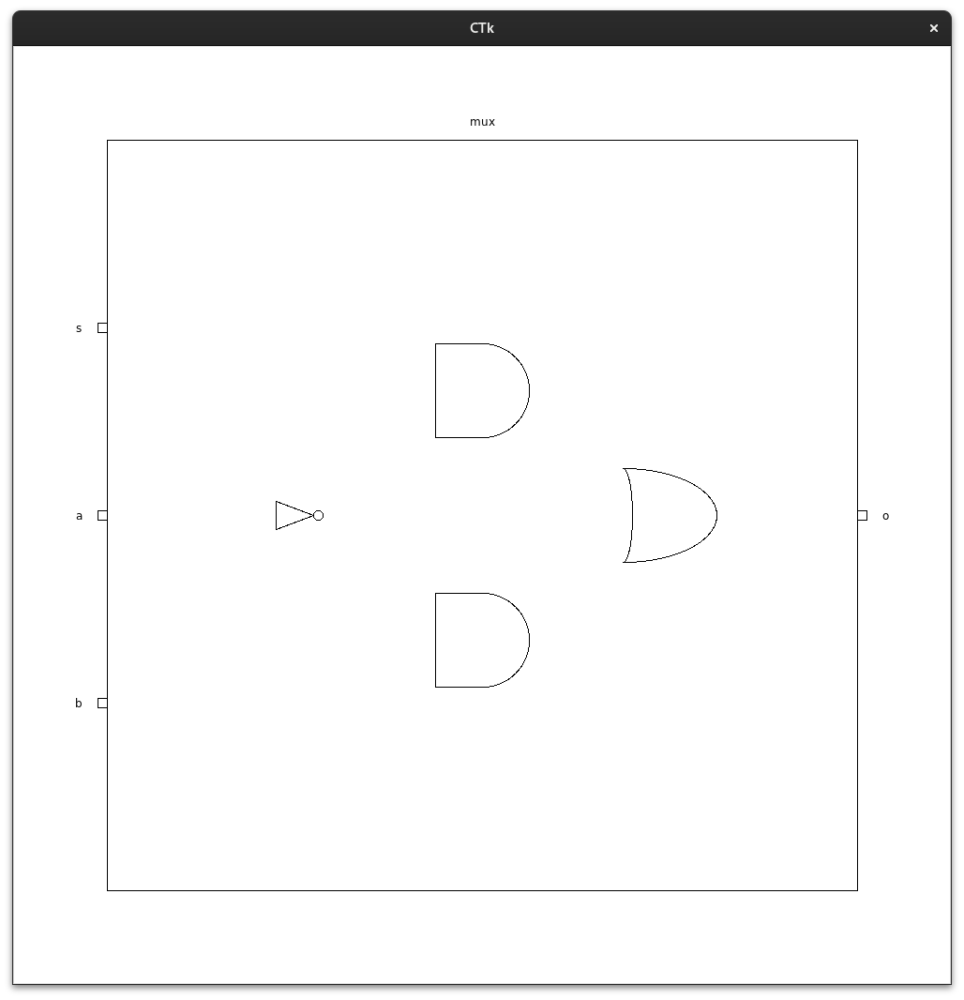

# VerilogViz

A tool to visualize circuits written in Verilog. Built on top of [pyverilog](https://github.com/PyHDI/Pyverilog).

## What works now
- Can render the main module (from the filename) as a rectangle and show the input and output ports
- Can render some basic primitive gates
- Arrange the instances and primitive gates in a level order

## Assumptions
To make it easier to start with, we have made some assumptions about the verilog code:
- Only Gate level abstraction is used. Behavioural and Dataflow modelling not yet supported.
- No parameter support
- No inout ports
- No vectors or arrays
- bufif1, bufif0, notif1, notif0 not yet supported

## Dependecies
Dependencies: iverilog
Python deps: pyverilog, customtkinter

## TODO
- Write verilog circuits to perform the diagram generation on
  - Simple combinational circuits
      - [X] Mux
      - [ ] Half adder
      - [ ] Full adder
      - [ ] Something with all verilog supported basic gates
  - Simple sequential circuits
      - [ ] Ripple counter
- [X] Basic GUI and command line parsing
- [X] Use pyverilog to parse verilog code
- [X] Create internal datastructures of nodes and edges
  - [X] Modules (input pins, output pins, instances)
  - [X] Wires
- [ ] Layout the nodes in a neat way using place and route
  - [X] Start with a box for the module
  - [X] Place equidistant input ports on the left side
  - [X] Place equidistant output ports on the right side
  - [X] Start from the output ports and move backwards building a tree, that will give you the layer number
  - [ ] Place the wires in between the nodes in a good looking way
  - [ ] Optimize the order of gates in each level to reduce the number of criss cross wires

## Future
- Add editor capabilities: Turn this into a full blown IDE for Verilog learners
    - Syntax highlighting
    - Checking for basic verilog mistakes
- Autogenerate testbench from input values
    - Add a way specify testcases in GUI and check for the expected output
- Display GTKWave like diagram in GUI
