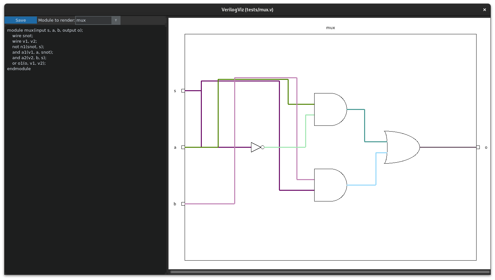
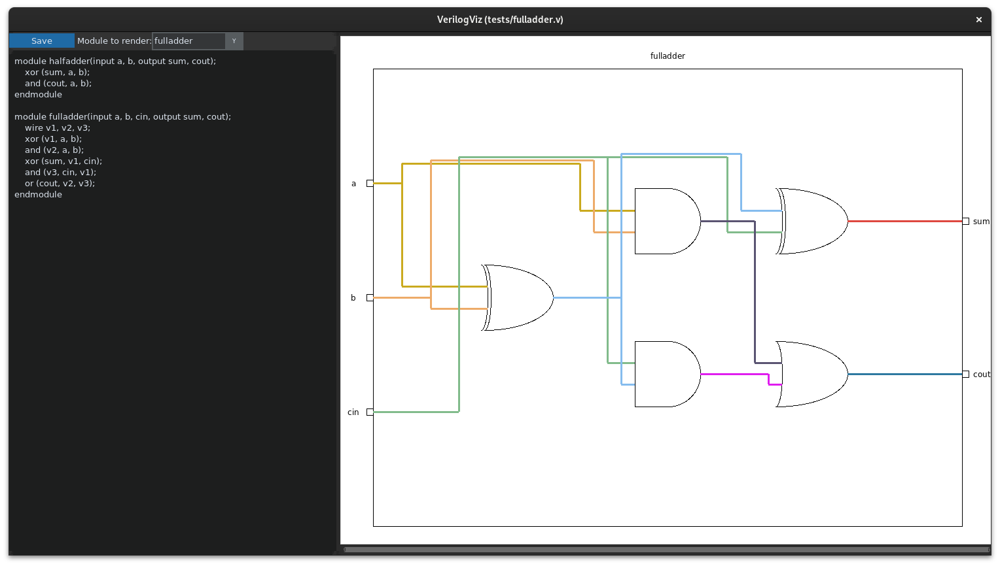

# VerilogViz

A tool to visualize circuits written in Verilog. Built on top of [pyverilog](https://github.com/PyHDI/Pyverilog).

## Screenshots

## Assumptions
To make it easier to start with, we have made some assumptions about the verilog code:
- Only Gate level abstraction is used. Behavioural and Dataflow modelling not yet supported.
- No parameter support
- No inout ports
- No vectors or arrays
- bufif1, bufif0, notif1, notif0 not yet supported

## Dependecies
Dependencies: iverilog

Python packages: pyverilog, customtkinter

## TODO
- Write verilog circuits to perform the diagram generation on
  - Simple combinational circuits
      - [X] Mux
      - [X] Half adder
      - [X] Full adder
      - [X] SR Latch
  - Simple sequential circuits
      - [ ] Ripple counter
- [X] Basic GUI and command line parsing
- [X] Use pyverilog to parse verilog code
- [X] Create internal datastructures of nodes and edges
  - [X] Modules (input pins, output pins, instances)
  - [X] Wires
- [ ] Layout the nodes in a neat way
  - [X] Start with a box for the module
  - [X] Place equidistant input ports on the left side
  - [X] Place equidistant output ports on the right side
  - [X] Start from the output ports and move backwards building a tree, that will give you the layer number
  - [X] Place the wires in between the nodes in a good looking way
  - [X] Render each wire in a different random color to make it easier to differentiate
  - [X] Create a basic editor like layout with code on left and diagram generated on right
  - [X] Add feature to render any module in the file not just the module with filename
  - [ ] Handle custom module instances (naming ports and instances)
  - [ ] Handle back edge across layers (SR Latch)
- [ ] Configure setup tools and Publish to PyPi
- [ ] Optimize the layout for better rendering
  - [ ] Handle overlapping horizontal lines in some cases. Also route the wires in more neater way
  - [ ] Optimize the order of gates in each level to reduce the number of criss cross wires
  - [ ] Use commutativity of primitive gates to reorder ports for better wire placement
  - [ ] Dynamically resize the two panes when resized

## Future work
- Add editor capabilities: Turn this into a full blown IDE for Verilog learners
    - Syntax highlighting
    - Checking for basic verilog mistakes
- Autogenerate testbench from input values
    - Add a way specify testcases in GUI and check for the expected output
- Display GTKWave like diagram in GUI

## Other similar projects
- [DigitalJS](https://github.com/tilk/digitaljs_online) ([Demo link](http://digitaljs.tilk.eu/))
